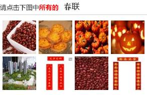
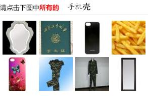
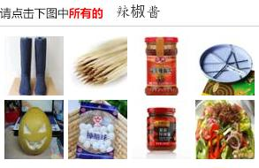

# fuck12306
12306 图片验证码识别测试

纯展示性质。可以跑起来玩。

识别率不高，没有用到识图返回的其他信息，理论上还有原图、相似图等可用。没有用 Google Images。

[如何评价12306的最新版验证码？](http://www.zhihu.com/question/28795373/answer/42181689)

## Prerequisites:

1. 需要安装PIL以及pytesseract库
2. 需要安装[google tesseract-ocr](https://code.google.com/p/tesseract-ocr/)

## Update

Day2: pytesseract OCR question. 锐化二值化处理文字后交给 tesseract。

2016-4-10: 更新至目前百度识图API

# 截图




pytesseract 用默认官方中文数据，其实效果很差，不过Good Case也有。



```
> 结果
(0, 0) 苹果充电器
(0, 1) 医师资格证|证件翻拍
(0, 2) 手机|手机皮套
(0, 3) 油炸薯条|炸暑条|双人
(1, 0) 手机套|苹果手机套|手机配件
(1, 1) 砂积石
(1, 2) [UNKOWN]
(1, 3) 波导|可转穿衣镜|手机
```



```
>
(0, 0) 靴|保温杯
(0, 1) 二粒小麦|刷子|成片种植
(0, 2) 香辣酱|瓶装调料|果酱
(0, 3) [UNKOWN]
(1, 0) 柚子|圆形果类
(1, 1) 雪饼
(1, 2) 李锦记|香辣酱|调料
(1, 3) 素菜
```
